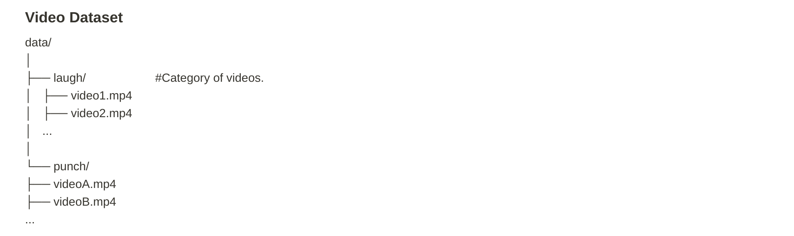
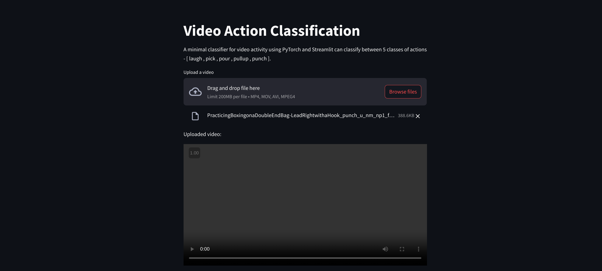

# Minor Project - 2  >> Visual Computing Lab

* Video Activity Classification for 5 classes

## Aaditya Baranwal

* B20EE001

### Dataset

(assets/data/)

>> The dataset consists of 180 images of 5 different classes of wearable accessories. The dataset is divided into 2 parts: Training and Testing. The training dataset consists of 150 images and the testing dataset consists of 30 images. The link to the dataset is given below:  
[Dataset](https://drive.google.com/file/d/1DRCeUsnSfPCPPWnRjvDNpujSDEAF_KWw/view?usp=sharing)

### WebAPP

 

### Report

[Document](assets/report.pdf)
